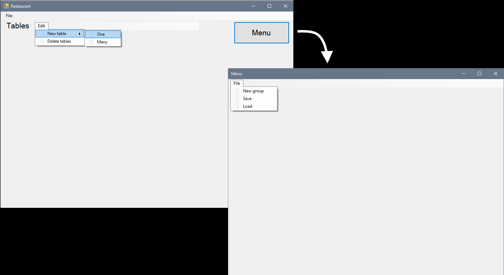
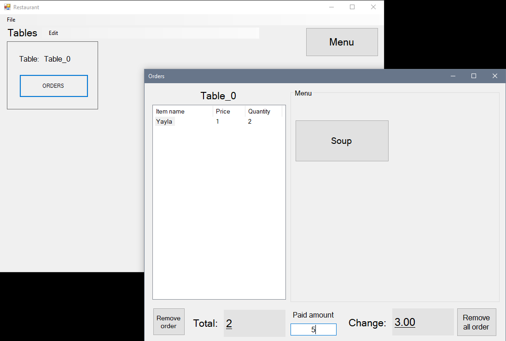

# Restaurant_WFA
Windows form app for basic restaurant management

# Interface

You can create menu, add prices, add tables, add consumable categories as you wish.

You can calculate total price after selecting a table.
You can do all necessary things restaurant app requires.

# Capabilities
- Add multiple tables
- Add multiple menu categories
- Calculate price on the table
- Removing an order (In case of misclick, currently removing an order removes ALL QUANTITY)
- Calculation of change
- Uses xml file type to store menus and tables
- Can be expanded easily
